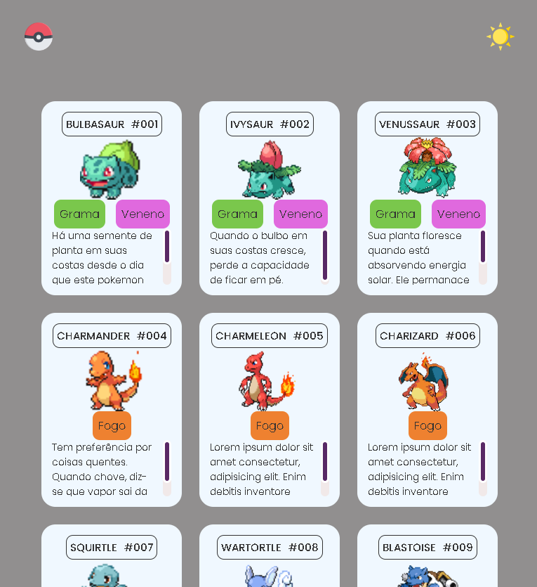

<h1 align="center">Lista de Pokemons</h1>

#### Esta página apresenta uma lista de Pokémon. Cada Pokémon é exibido como um cartão, contendo informações sobre cada. O design é responsivo e também inclui um botão para alterar o tema da página. Esta página proporciona uma experiência visual agradável para os fãs de Pokémon

## Tecnologias utilizadas
- HTML
- CSS
- JavaScript

### Autor
<a href="https://avatars.githubusercontent.com/u/146045369?v=4">
 
  
</a>
 <h3>Lucas Noetzold</h3>
  
 <b>Entre em contato!</b>

